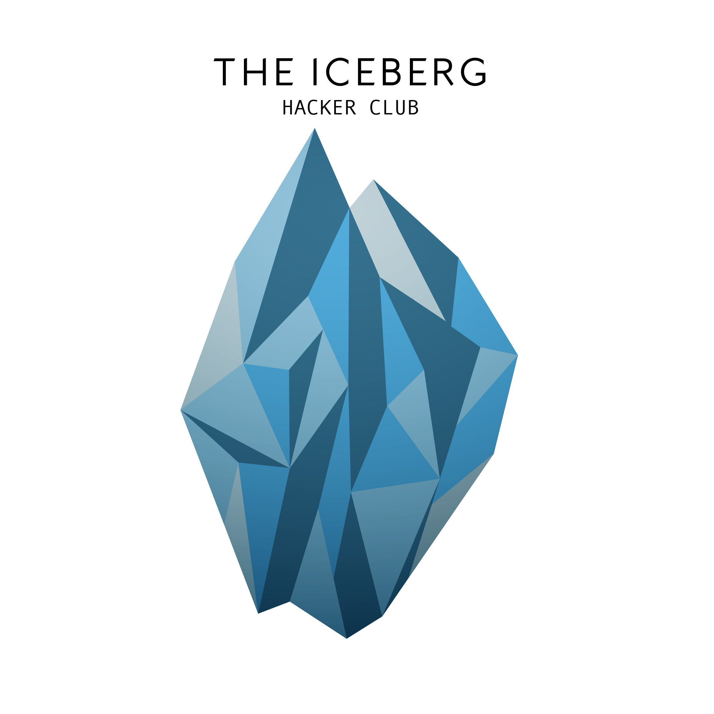

# Guidelines to The Iceberg Hacker Club

The main goal of this Hacker Club is to unite people with the same passion for software development, in search of new experiences and learning opportunities. We believe this passion comes together with a great desire to learn, teach, and help, therefore being able to contribute to the comunity as a whole.

### Goals:

* Search for new experiences and learning opportunities in software development.
* Create a forum to: discuss subjects and articles related to tech; arrange meetings; ask for help/suggestions when stuck in a problem; ...
* Meet the members every month (or so) to develop a project chosen by the group. We can discuss/choose the project ideas freely before the meeting (eg. A mobile game in Kotlin; An API in Rust; ...).
* Utilizar o conhecimento dos membros para contribuir para projetos open source. Contribuir ativamente para comunidade open source é algo extramamente importante para manter a qualidade da comunidade de desenvolvedores, porém realizar essa tarefa sozinho pode ser muitas vezes desafiadora. Então quebraremos essa barreira buscando contribuir como um grupo :)
* Compartilhar recursos entre os membros e se possível para comunidade, Ex: E-books, tutoriais, videos, scripts, etc.
* Disponibilizar todos os projetos feitos no HC como open source nesse github, para que possamos contribuir para comunidade e encorajar outras iniciativas como esta.
* Criar um blog onde possamos compartilhar com o mundo nossos aprendizados e experiências.
* Manter uma cultura de respeito e amizade entre os membros do hc, mesmo que tenhamos como objetivo principal o aprendizado, buscaremos sempre nos divertir o máximo possível :)

### Não temos como objetivos do hacker club:

* Discutir sobre qual a melhor ferramenta pessoal de desenvolvimento (Ex: Emacs, Vim, Tmux, Mac, Linux, Atom, etc). Acreditamos que cada pessoa tem suas preferências e motivos para usar uma determinada ferramenta. Por isso, buscaremos sempre alternativas para não faltar respeito com algum membro.
* O famoso _blamework_, não iremos nos reunir para falar mal a respeito de alguma tecnologia, linguagem de programação ou framework.
* Não temos como objetivo criar nenhum projeto de iniciativa privada de código fechado ou que beneficie apenas uma organização/pessoa.
